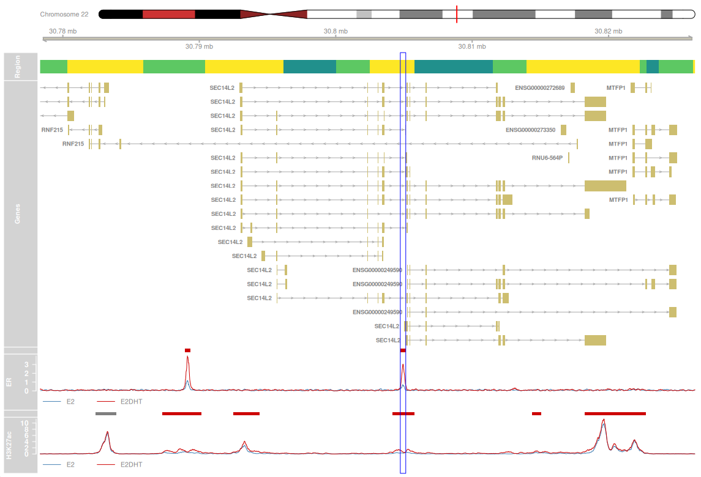

```{r, include = FALSE}
knitr::opts_chunk$set(
  collapse = TRUE,
  comment = "#>",
  message = FALSE, warning = FALSE,
  fig.width = 10, fig.height = 8
)
```

# The package extraChIPs

## Overview

### Description

This is a 90 minute workshop written for EuroBioc26 and a Bioconductor Workflow under active development.
The primary aim is to enable analysis of ChIP-Seq data, and has been developed with this specific data type in mind.
However, the principles can plausibly be extended to ATAC-Seq data, with a clear caveat around the counting of alignments, which may require more care for ATAC-Seq.

Two different ChIP targets (ER$\alpha$ and H3K27ac) will be analysed using complementary strategies, then a data integration stage performed, highlighting the true capabilities of `r BiocStyle::Biocpkg("extraChIPs")`.
Both ChIP targets were prepared in the ZR-75-1 breast cancer cell line under control conditions (Estrogen; E2) then supplemented by *dihydrotestosterone* (E2+DHT).
Raw data is available at https://www.ncbi.nlm.nih.gov/Traces/study/?acc=PRJNA509779&o=acc_s%3Aa with these samples pre-processed using the code at https://github.com/smped/PRJNA509779 [@Pederson-fd].

The original publication containing the detailed biological background is at https://doi.org/10.1038/s41591-020-01168-7 [@Hickey2021-mz]

### Pre-requisites

List any workshop prerequisites, for example:

* Basic knowledge of R syntax
* Understanding of piping in `R` 
* Familiarity with `ggplot2` and the wider `tidyverse`
* Familiarity with the GenomicRanges and SummarizedExperiment classes

<!-- List relevant background reading for the workshop, including any -->
<!-- theoretical background you expect students to have. -->

<!-- * List any textbooks, papers, or other reading that students should be -->
<!--   familiar with. Include direct links where possible. -->

### Participation

<!-- Describe how students will be expected to participate in the workshop. -->

### _R_ / _Bioconductor_ packages used

Whilst the primary focus will be on the usage of `extraChIPs`, additional important packages being discussed will include:

- `r BiocStyle::Biocpkg("qsmooth")` [@Hicks2018-uw]
- `r BiocStyle::Biocpkg("quantro")` [@Hicks2015-ee]
- `r BiocStyle::Biocpkg("plyranges")` [@Lee209-gb]
<!-- - `r BiocStyle::Biocpkg("DiffBind")` and `r BiocStyle::Biocpkg("csaw")` -->

```{r load-packages}
library(tidyverse)
library(extraChIPsWorkshop)
library(rtracklayer)
library(plyranges)
library(Rsamtools)
library(csaw)
library(BiocParallel)
library(DFplyr)
library(quantro)
library(qsmooth)
library(edgeR)
library(magrittr)
library(patchwork)
library(ggrepel)
library(glue)
library(viridisLite)
theme_set(theme_bw())
```


### Time outline

| Activity                       | Time |
|--------------------------------|------|
| Annotation Preparation         | 15m  |
| Fixed-Width Peaks (ER$\alpha$) | 30m  |
| Sliding Windows                | 30m  |
| Integration of Datasets        | 15m  |

### Workshop goals and objectives

Today we will be analysing two ChIP-Seq datasets.
All pre-processing has been performed, including read QC, deduplication, alignment to the genome and peak calling.
This will have produced `.bam` files containing alignments and `.narrowPeak` files identifying the genomic regions identified as peaks by MACS2 [@Zhang2008-ms].

### Learning goals

* preparation of genomic region annotations for interpretation of ChIP-seq data
* making informed decisions for normalisation
* performing Differential Signal Analysis (DSA)
* integration of two or more ChIP-seq targets

### Learning objectives

<!-- * analyze xyz data to produce... -->
<!-- * create xyz plots -->
<!-- * evaluate xyz data for artifacts -->

## Workshop

1. Annotation Preparation
2. Differential Signal Analysis Using Fixed-Width Peaks
3. Differential Signal Analysis Using Sliding Windows
4. Integration of two or more ChIP targets

# Annotation Preparation

During sample preparation, a reference genome will have been selected and for today's dataset, reads were aligned to the hg19/GRCh37 reference genome.
This will contain not only chromosome sequences, but a set of annotations will have been defined annotating genes, transcripts and exons.
For today, we'll use those defined by [GENCODE version v44, lifted over to hg19](https://www.gencodegenes.org/human/release_44lift37.html), and which roughly corresponds to Ensembl Release 110.

## Defining the Correct Genome

The genome information can usually be obtained from the header of any associated bam files, but as an initial introduction, `extraChIPs` can provide this easily and flexibly.
The key data structure in the Bioconductor ecosystem for the information is a `Seqinfo` object.

```{r sq}
sq <- defineSeqinfo("GRCh37", chr = TRUE)
sq
```

`defineSeqInfo()` is a quick and easy shortcut for defining a `Seqinfo` object, however no scaffolds or patches will be included, only the main chromosomes.
By default the mitochondrial chromosome will also be omitted, although this can easily be added by passing the argument `mito = "M"` to include `chrM` in the output.
The `chr` prefix is added by default and this can be omitted by passing `chr = FALSE`

## Annotating Genomic Regions

Next we might like to load our gene annotations.
These have been provided in the directory `inst/extdata` and contain only the gene, transcript and exon-level annotations from the original gtf.
After loading, add the seqinfo object to the returned GenomicRanges object to ensure all of our objects contain the identical genomic co-ordinates.

```{r load-gtf}
f <- system.file(
  'extdata/annotation', 'gencode.v44lift37.reduced.gtf.gz', 
  package = "extraChIPsWorkshop"
)
gtf <- import.gff(f)
seqinfo(gtf) <- sq
gtf
```

Now we have genes annotated, we know where all transcripts begin and end.
We can use `defineRegions()` to define promoters, upstream promoters, gene-bodies and intragenic regions.
this will classify every base in the genome defined by the `Seqinfo` object into one of these features.

- By default, promoters are defined as 2500bp upstream & 500 bo downstream from any TSS, although this can easily be changed. 
Overlapping promoters from multiple transcripts within a gene are merged into larger promoter regions.
- Similarly upstream promoters are simply defined as being 5000bp upstream from a TSS, excluding the regions already defined as promoters.
- Setting `intron = FALSE` will define any region within a gene, excluding promoter regions, as a gene body. If `intron = TRUE`, the intragenic regions will be separated into introns and exons.


```{r define-regions}
split_gtf <- split(gtf, gtf$type)
regions <- defineRegions(
  genes = split_gtf$gene, 
  transcripts = split_gtf$transcript, 
  exons = split_gtf$exon, 
  intron = FALSE
)
```

All genes and transcripts associated with a defined range in this object are saved in the mcols element.
As an example, we might wish to find all regions where *SEC14L2* has been associated.

```{r sec14l2}
sec14l2 <- subset(gtf, type == "gene" & gene_name == "SEC14L2")
subsetByOverlaps(regions$promoter, sec14l2)
```

Here we can see three distinct promoters overlapping *SEC14L2*, with two associated with the multiple *SEC14L2* transcripts, and the third associated with overlapping transcripts from other genes.

## Loading a BlackList and a GreyList 

Most genomes contain regions which are problematic for different data types and the ENCODE blacklists are commonly used in ChIP-Seq [@Amemiya2019-et] to exclude low-confidence regions.
These are readily available from https://github.com/Boyle-Lab/Blacklist/ and the blacklist for hg19/GRCh37 has been included in the workflow package.

```{r bl}
bl <- system.file(
  'extdata/annotation', 'hg19-blacklist.v2.bed.gz', package = "extraChIPsWorkshop"
)
```

Similarly, each experiment will likely have low-confidence regions where the input sample can be considered as unreliable.
Today they have been pre-pepared and provided, but the package `r BiocStyle::Biocpkg("GreyListChIP")` can be used for your own experiment by following the provided vignette.

```{r gl}
gl <- system.file(
  'extdata/annotation', 'SRR8315192_greylist.bed', package = "extraChIPsWorkshop"
)
```

Together, the blacklist and greylist provide a set of regions where any peaks should be excluded from analysis.
We can use the standard `import.bed()` file from `rtracklayer` to import these, or use the convenience function `importPeaks()` provided by `extraChIPs`.

```{r demo-import}
c(bl, gl) %>% 
  importPeaks(seqinfo = sq, type = "bed")
```

By including the seqinfo object, the consistent genomic definition will be added to each of these files, with the returned object being a `GRangesList`.
In most cases we simply wish to define a set of ranges marked for exclusion and we can create this in a convenient piped command.

```{r exclude-ranges}
exclude_ranges <- c(bl, gl) %>% 
  importPeaks(seqinfo = sq, type = "bed") %>% 
  unlist() %>% 
  GenomicRanges::reduce()
```

Note that `reduce()` was called directly from the `GenomicRanges` namespace. 
This is to avoid conflicts with `reduce()` from `purrr` which is loaded by the `tidyverse`.
Some people may prefer to use the `r BiocStyle::CRANpkg("conflicted")` package to resolve these conflicts.

# Differential Signal Analysis Using Fixed Width Peaks


## Loading and Inspecting Peaks

Now that we've prepared the external data, we can move to the peaks we're actually interested in.
The first set of peaks, we'll work with are associated with the Estrogen Receptor (ER$\alpha$) after immunoprecipitation, and have been prepared under two conditions, 1) control (media with estradiol, E2) and 2) DHT-treated (E2+DHT).
The complete sample data frame, including our later samples, can be formed as follows.

```{r samples}
treat_levels <- c("E2", "E2DHT")
samples <- tibble(
  id = paste0("SRR83151", seq(80, 92)),
  target = case_when(
    id %in% paste0("SRR83151", seq(80, 85)) ~ "ER",
    id %in% paste0("SRR83151", seq(86, 91)) ~ "H3K27ac",
    id == "SRR8315192" ~ "input"
  ),
  treat = case_when(
    id %in% paste0("SRR83151", seq(80, 82)) ~ "E2",
    id %in% paste0("SRR83151", seq(86, 88)) ~ "E2",
    id %in% paste0("SRR83151", seq(83, 85)) ~ "E2DHT",
    id %in% paste0("SRR83151", seq(89, 91)) ~ "E2DHT",
    TRUE ~ NA
  ) %>% 
    factor(treat_levels)
) %>% 
  split(.$target)
```

We split the above by the ChIP target so let's focus on the ER samples using that list element.

```{r samples-er}
samples$ER <- samples$ER %>% 
  mutate(
    peak_file = paste0(id, "_peaks.narrowPeak.gz"),
    peak_path = system.file("extdata/peaks", peak_file, package = "extraChIPsWorkshop")
)
```

The peaks have been prepared using `macs2` set to detect 'narrowPeaks' which produces files in `.narrowPeak` format.
This effectively extends the `.bed` format with the addition of key metrics defining the confidence `macs2` has in each peak.
The final column `peak` denoted the position within the provided range, where the peak signal is estimated to be.
Let's just look at the first file

```{r import-peaks1}
importPeaks(samples$ER$peak_path[1])
```

Here we can see peaks from a scaffold loaded first, which we haven't included in our `seqinfo` object.
By including this object in the call to `importPeaks` any peaks outside the defined chromsomes will be excluded.
This feature makes downstream data integration far simpler.

We can also pass our combination of black- and grey-listed ranges to the argument `blacklist`, as well as using the default setting of sorting the peaks into genomic order (`sort = TRUE`).
Finally, if importing `.narrowPeak` files we can optionally set the argument `centre = TRUE` which will recalculate the peak to being an absolute position, instead of being a relative position.

```{r er-peaks}
er_peaks <- importPeaks(
  samples$ER$peak_path, blacklist = exclude_ranges, seqinfo = sq, centre = TRUE
)
names(er_peaks) <- samples$ER$id
er_peaks
```

Again, we have a `GRangesList` containing each sample.

The first thing we might like to is compare peak widths for each sample.
Although, we'll used fixed-width peaks when performing differential signal analysis, the output from a peak caller will generally return peaks of varying widths.
The convenience function, `plotGrlCol()` will plot a column from the `mcols` element of any `GRangesList`, and will create a boxplot the width of ranges within each element by default.
Given the plot is a standard `ggplot` object, we can simply transform the y-axis using `scale_y_log10()` using conventional syntax.

```{r plot-peak-width}
plotGrlCol(er_peaks) + scale_y_log10()
```

This figure shows a boxplot for each element, with the total number of peaks shown as a label at the median position for every box.
The 10th percentile for all values across all elements is also shown by default as a blue dashed line.

We can easily modify this to show any of the other columns, such as the `score` column.
The function enables multiple geoms (`r pander::pander(formals(plotGrlCol)$geom)`), and if we pass the samples data.frame (`df = samples$ER`), we can specify which column matches the names of each `GRangesList` element (`.id = "id"`).
As a result, additional aesthetics, like `fill` can be added using this data frame.
Labels and horizontal lines can also be omitted if preferred, in any combination.

```{r plot-peak-scores}
treat_colours <- setNames(c("steelblue", "red3"), treat_levels)
er_peaks %>% 
  plotGrlCol(
    var = "score", geom = "violin", quantile.linetype = 1, quantiles = 0.5, 
    .id = "id", df = samples$ER, fill = "treat", 
    ## Setting the size of the quantile to NULL will hide the label whilst 
    ## showing the line. Here, we're showing the 50th percentile.
    q = 0.5, q_size = NULL, 
    ## Setting `total_geom= "none"` will also hide the totals
    total_geom = "none"
  ) +
  scale_fill_manual(values = treat_colours) +
  scale_y_log10()
```


Now let's check how many peaks identified in each sample are shared between the other samples, using `plotOverlaps()`
Under the hood, this uses the package `r BiocStyle::CRANpkg("SimpleUpset")` to create UpSet plots if the input list object has 4 or more elements.
It should be noted that the peak numbers shown here *are not the true peak numbers*.
The ranges found in each element are first merged, with overlapping ranges combined.
Instead, this figure shows the total number of the merged peaks which each sample overlaps.
This step is included given that peaks will *almost never* share identical co-ordinates between even technical replicates and attempting to show identical co-ordinates would be uninformative.

```{r plot-er-overlaps}
plotOverlaps(
  er_peaks, 
  sort_sets = "none", set_col = rep(treat_colours, each = 3), exp_sets = 0.25
)
```

As we can see, there's a good number of peaks identified in every sample, then a mix of combinations with peaks identified in only one, two, three, four or five samples.
Only one intersection seems to represent peaks identified exclusively in DHT treated samples.
This illustrates our challenge nicely!
We're not going to be looking for peaks where ER is absent/persent in either condition.
Rather where going to try and find peaks where the *signal changes* after DHT treatment, i.e. Differential Signal Analysis

## Forming Consensus Peaks

Moving towards differential signal analysis, we need to carefully define the regions, i.e. peaks, we'll use to detect changes in ER binding.
It's important to recognise the nature of ChIP-Seq signal at this point.
If we assumed stict diploidy for every genoic region, which is perhaps unrealistic for cell lines, there would be a maximum of 2 DNA fragments able to be pulled down from every cell in the source material.
Our combined signal, represents the proportion of possible sites within the source material where the ChIP target can be bound.
The saturation point would be exactly two DNA fragments from every cell in the sample.

Changes in ChIP signal are subtly different to differential expression in RNA-Seq.
Differential Signal Analysis in ChIP-Seq represents the change in the number of sites within the source material which our target has bound.
This is a dynamic process, where changes may occur differently over time in different cells, and in most cell lines, there is considerable diversity within the cell culture.
ChIP-seq represents a snapshot at a given time point.

In order to compare between treatment groups, we need to define strict regions within which we will compare signal.
Given that we have two conditions, we could choose to define a set of *consensus regions* across all samples or within each treatment.
Today, we'll form consensus peaks within each treatment group, then across treatment groups.
Consensus peaks can simply be considered as genomic regions where signal is detected across multiple samples.

As a first example, let's make consensus peaks just from the E2 treated samples.
We can take advantage of piping to do this *on-the-fly* just to inspect the output

```{r e2-consensus}
er_peaks %>% 
  subset(samples$ER$treat == "E2") %>% 
  makeConsensus(p = 2/3)
```

Here we've set the condition that to keep a peak, it needs to have been detected in 2/3 of samples.
We've relied on the default setting `method = "union"` which simply takes the union of ranges across all samples, then finds how many samples overlap the union ranges.

In addition, we can keep any additional columns, such as the centre positions we've already included as we loaded the peaks.

```{r e2-consensus-centre}
er_peaks %>% 
  subset(samples$ER$treat == "E2") %>% 
  makeConsensus(p = 2/3, var = "centre")
```

This will be returned as a list column, so taking the average may be a wise move to find the approximate centre position as an average of all individual samples.

```{r e2-consensus-centre-mean}
er_peaks %>% 
  subset(samples$ER$treat == "E2") %>% 
  makeConsensus(p = 2/3, var = "centre") %>% 
  mutate(centre = map_dbl(centre, mean))
```

Now we understand the process for a given condition, we can use `lapply` to split our `GRangesList` by treatment group, then perform the above process across both treatment groups.
As a final step, we're using `mapByFeature()` to assign peaks to genes.
This can utilise HiC (or HiChIP) interactions to confidently map long-range interactions, however at it's simplest mapping can be performed simply by providing a set of promoters and genes, with each peak being mapped to the most likely, or nearest gene, up to 100kb away from the peak.

```{r consensus-peaks}
consensus_peaks <- er_peaks %>% 
  split(samples$ER$treat) %>% 
  lapply(
    \(peaks) {
      peaks %>% 
        makeConsensus(p = 2 / 3, var = "centre") %>% 
        mutate(centre = map_dbl(centre, mean)) 
    }
  ) %>% 
  GRangesList() %>% 
  makeConsensus(var = "centre") %>% 
  mutate(centre = as.integer(map_dbl(centre, mean))) %>% 
  mutate(
    region = bestOverlap(., regions) %>% fct(names(regions))
  ) %>% 
  mapByFeature(genes = split_gtf$gene, prom = regions$promoter)
```

Using this process, we've not only created a set of consensus peaks, but we've mapped them to key defined genomic regions and the most likely gene being targeted byt he binding event.

Again, we can use `plotOverlaps()` to identify peaks unique to either condition, or shared between the two.
Given there are only two elements to the input `GRangesList`, a VennDiagram will be produced instead of a UpSet plot.

```{r plot-consensus-overlap}
GRangesList(
  E2 = filter(consensus_peaks, E2),
  E2DHT = filter(consensus_peaks, E2DHT)
) %>% 
  plotOverlaps(set_col = treat_colours)
```

In the final line when creating consensus peaks, we've also mapped each peak to the feature that it overlaps with the highest proportion, using `bestOverlap()`.
This way we have not only created our consensus peaks, but we've mapped them to the most likely genomic feature.
Despite how terribly unfashionable pie charts are, they can still be useful for looking at the distribution of regions our peaks have been mapped to.

```{r plot-pie}
region_colours <- setNames(viridis(length(regions), direction = -1), names(regions))
plotPie(consensus_peaks, fill = "region", total_size = 5) +
  scale_fill_manual(values = region_colours)
```

This figure is highly customisable, with labels able to be modified using `glue` syntax, but for now let's move on.

## DSA With Fixed-Width Peaks

### Loading Counts

These consensus peaks will be of variable width, and as such, the final step is to create the fixed width peaks we can use for DSA.
Here we can take advantage of `mutate` from plyranges to add the chromosome names to the centre.
This is followed by the helper function `colToRanges()` which will *overwrite the existing ranges* with another provided range.

```{r centred-peaks}
centred_peaks <- consensus_peaks %>% 
  mutate(range = paste(seqnames(.), centre, sep = ":")) %>% 
  colToRanges("range", seqinfo = seqinfo(.)) %>% 
  resize(width = 400, fix = 'center') 
```

In the above, we're creating a character vector using `paste()` by adding the chromosome names to the estimated centre, and because this is coercible to a `GRanges` object, we can then shift it to the actual ranges of the object.
After performing this operation, we're resizing the ranges to be 400bp, keeping the previously estimated centre at the centre of the ranges.
We may remember from our earlier plot showing peak width, that >90% of peaks will be wider than 184bp, and as such, 200bp positioned at our best estimate of the centre position, may be a suitable choice for performing analysis.

In this way we've created a suitable representation of the consensus peaks on which we can perform our analysis.
It's important to note that the peaks of interest are the consensus peaks, these are simply a statistically useful representation of them on which we can perform our analysis.

```{r export-er-se, eval = FALSE}
################
## DO NOT RUN ##
################
## This is my code for preparing the counts and requires 6 bam files
## Counts will be loaded in the next chunk
## Please see inst/scripts/data_setup.R for details of the download
bam_path <- file.path("~", "extraChIPs_data", "bam")
bfl <- file.path(bam_path, paste0(samples$ER$id, ".bam")) %>% 
  BamFileList()
names(bfl) <- samples$ER$id
rp <- readParam(pe = "none")
er_se <- regionCounts(bfl, centred_peaks, ext = 175, param = rp)
seqinfo(er_se) <- sq
colData(er_se) <- colData(er_se) %>% 
  mutate(
    id = rownames(.),
    bam.files = basename(bam.files)
  ) %>% 
  left_join(
    dplyr::select(samples$ER, id, target, treat), by = "id"
  )
write_rds(er_se, here::here("inst/extdata/counts/er_se.rds"), compress = "gz")
```

**NB: Counts were parsed from bam files using a standard laptop running Ubuntu with 16Gb RAM and the output saved within the workshop package using the above chunk.
We will load these pre-pepared counts in the next chunk.**

The next step after defining the peaks would be to load the counts directly from the bam file containing the alignments.
The code chunk above is how counts were prepared for this workshop noting the following steps

1. Define a `BamFileList` then set the names to match the `id` column in `samples$ER`
2. Use `regionCounts()` from the package `r BiocStyle::Biocpkg("csaw")` [@Lun2016-cs], first setting any key parameters for reading alignments.
Here, the reads were single-end, so we set `pe = "none"`. The reads were extended by 175 bp as is common for ChIP-seq as this was the estimated fragment length from the macs2 output
3. The `colData` element of the returned `SummarizedExperiment` was modified using `mutate()` and `left_join()` from `r BiocStyle::Biocpkg("DFplyr")` to incorporate the required sample information


```{r er-se}
f <- system.file("extdata/counts/er_se.rds", package = "extraChIPsWorkshop")
er_se <- read_rds(f)
rowRanges(er_se)
colData(er_se)
```

Note that the value provided in the `totals` column *corresponds to the total number of reads in the original bam files*, and that only a small fraction of the alignments fall within the defined fixed-width peaks.
There is a QC metric "Fraction of Reads in Peaks" (FRIP) which is commonly used in ChIP-QC which is used to assess comparative quality between samples.
See [here](https://ishaaq34.github.io/chipseq-tutorial-readthedocs/12_frip_quality_metrics/) for a good tutorial, and this is more formally calculated by many tools which should be incorporated into data preparation workflows, as suggested by the ENCODE consortium [@Landt2012-tn]

Note however, that we're counting fixed-with, centred peaks here so these counts will be a slight undercount of the true values.
The true values were estimated during sample preparation with an example [here](https://github.com/smped/PRJNA509779/blob/main/output/macs2/SRR8315180/SRR8315180_frip.tsv) as produced by the [workflow used for data preparation](https://github.com/smped/PRJNA509779/blob/main/workflow/scripts/get_frip.R).

```{r er-frip}
colData(er_se) %>% 
  as_tibble() %>% 
  mutate(
    counted = assay(er_se, "counts") |> colSums(),
    FRIP = counted / totals
  )
```


### Normalisation

Now that we have our counts, the first thing we might like to do is inspect them in order to select a normalisation method.
However, normalisation in ChIP-seq takes a little more care than RNA-seq.
It is quite plausible that the number of sites bound by a ChIP target may be substantially different under varying conditions.
A canonical example of this is the Androgen Receptor (AR) which is sequestered in the cytoplasm in the absence of androgens, then is translocated to the nucleus upon encountering it's ligand.
Almost no binding would be expected in the absence of androgens, followed by a significant increase in binding.
Under these circumstances, the most appropriate normalisation would be library size only.

The most simple way to normalise count data is to scale by library size, as underlies the CPM or logCPM transformation.
Let's add a logCPM assay to our `SummarizedExperiment` object in order to help as we inspect our data.


```{r add-logcpm}
assay(er_se, "logCPM") <- er_se %>%
  cpm(log = TRUE) %>% 
  set_rownames(rownames(er_se)) 
```

Now we can compare our samples both before and after normalisation using `plotAssayDensities()`.
For before normalisation, can use the `log1p()` transformation on the raw counts.

```{r plot-er-densities}
A <- plotAssayDensities(er_se, assay = "counts", colour = "treat", trans = "log1p") +
  scale_colour_manual(values = treat_colours)
B <- plotAssayDensities(er_se, assay = "logCPM", colour = "treat") +
  scale_colour_manual(values = treat_colours)
A + B + 
  plot_layout(guides = "collect", axes = "collect") +
  plot_annotation(tag_levels = "A")
```

Notice how the densities before normalisation were quite spread out, then after normalising by library size the densities appeared far more similar.

Other technical checks we might like to perform are RLE and PCA.
Using `plotAssayRle()`, we can check RLE by individual sample as is most common.
Alternatively, we can visualise RLE by treatment group to pickup any more subtle differences between treatments.

```{r plot-er-rle}
A <- plotAssayRle(er_se, "logCPM", fill = "treat") +
  scale_fill_manual(values = treat_colours)
B <- plotAssayRle(er_se, "logCPM", fill = "treat", by_x = "treat") +
  scale_fill_manual(values = treat_colours)
A + B + 
  plot_layout(guides = "collect", axes = "collect", widths = c(2, 1)) +
  plot_annotation(tag_levels = "A")
```

Similarly `plotAssayPCA()` allows for clear data inspection and manipulation as a standard `ggplot` object

```{r plot-er-pca}
plotAssayPCA(er_se, "logCPM", colour = "treat") +
  scale_colour_manual(values = treat_colours)
```

Beyond library size normalisation, we could choose many of the standard RNA-Seq normalisation methods.
The most conservative would be `method = "none"`, which corresponds to library size normalisation, with common alternatives being TMM [@Robinson2010-qp] or RLE [@Anders2010-sd].
RLE is commonly used by the package `r BiocStyle::Biocpkg("DiffBind")` [@DiffBind2012] making it an established choice for ChIP-Seq data.

Before we make our decision, we can check to see if there is an overall shift in signal corresponding to global change in binding.
The package `r BiocStyle::Biocpkg("qantro")` [@Hicks2015-ee] can be used for this, and the primary test returned is for the equivalence of medians between groups, returned as the `anovaPval`.
If H~0~ is accepted under this test, methods such as TMM or RLE may be suitable options.

```{r qtest-er}
qtest <- quantro(assay(er_se, "logCPM"), groupFactor = er_se$treat)
qtest
```

The test results for this dataset are p >> 0.05 and as such we should accept H~0~ that sample medians are equivalent between groups.
Permutation tests are also able to be performed, however these are uninformative for n = 6 samples and were not performed here.

### Model Fitting

From here we move to the analysis itself, and using the standard approaches of `r BiocStyle::Biocpkg("edgeR")` [@Chen2025-ed] we can define our model matrix.
The function `fitAssayDiff()` provides the same normalisation options as `edgeR::calcNormFactors()` with RLE corresponding to the normalisation approach favoured by `r BiocStyle::Biocpkg("DESeq2")`.
Three tests are implemented:

1. `method = "qlf"` fits the glmQLFTest from edgeR using counts and the selected normalisation method
2. `method = "lt"` fits the `limma-trend` model on logCPM values [@Law2014-xq], either as passed by a suitable additional assay, or after applying the selected normalisation method.
3. `method = "wald"` fits the nbinomWaldTest from `DESeq2` [@Love2014-de], noting this corresponds to the default model in `DiffBind`

By default, the totals *as derived from the complete bam file* are used for library size.
Choosing another option should only be performed with caution and relies on the total signal being highly consistent between all treatment groups.
If the ChIP target shows markedly different signal levels, as may be expected with the Androgen Receptor when sequestered in the cytoplasm, any alternative columns will be highly inappropriate.

Although not demonstrated here, setting a value for the `fc` argument will switch the testing `glmQLFTreat()` which applies a range-based null-hypothesis [@McCarthy2009-qf], or will apply the analogous strategy for the nbinomWaldTest in `DESeq2`.


```{r er-diffsig}
X <- model.matrix(~treat, data = colData(er_se))
er_diffsig <- er_se %>% 
  fitAssayDiff(design = X, norm = "TMM", asRanges = TRUE, method = "qlf") %>% 
  addDiffStatus(drop = TRUE) 
table(er_diffsig$status)
```

The standard MA-plot and volcano-plots can be easily produced from these results.
The following code does make these look a little more complicated, however:

1. The convenience function `as_tibble.GRanges()` is deomnstrated which will coerce the genomic ranges to character vector column whilst returning the mcols element as a tibble alongside the ranges. (Seqinfo is lost in this step)
2. The gene-names are manipulated using `map_chr(gene_name, paste, collapse = ";")` to coerce from a list to a character vector, making labelling simpler
3. Labels are added for the top-ranked peaks by (A) logFC and (B) significance

```{r ma-plots}
status_colours <- c(
  Undetected = "grey90", Unchanged = "grey50",
  Decreased = "royalblue2", Increased = "red3"
)
A <- er_diffsig %>%
  as_tibble() %>% 
  ggplot(aes(logCPM, logFC)) +
  geom_point(aes(colour = status), alpha = 0.8) +
  geom_smooth(se = FALSE, method = "loess") +
  geom_label_repel(
    aes(colour = status, label = gene_name),
    data = . %>% 
      dplyr::filter(status %in% c("Increased", "Decreased")) %>% 
      arrange(desc(logFC)) %>% 
      mutate(gene_name = map_chr(gene_name, paste, collapse = "; ")) %>% 
      dplyr::filter(gene_name != "") %>% 
      dplyr::slice(seq_len(10)),
    size = 3, alpha = 0.8, show.legend = FALSE, fontface = "italic"
  ) +
  labs(colour = "Status") +
  scale_colour_manual(values = status_colours) 
B <- er_diffsig %>%
  as_tibble() %>% 
  ggplot(aes(logFC, -log10(PValue))) +
  geom_point(aes(colour = status), alpha = 0.8) +
  geom_label_repel(
    aes(colour = status, label = gene_name),
    data = . %>% 
      dplyr::filter(status %in% c("Increased", "Decreased")) %>% 
      arrange(PValue) %>% 
      mutate(gene_name = map_chr(gene_name, paste, collapse = "; ")) %>% 
      dplyr::filter(gene_name != "") %>% 
      dplyr::slice(seq_len(10)),
    size = 3, alpha = 0.8, show.legend = FALSE, fontface = "italic"
  ) +
  labs(colour = "Status") +
  scale_colour_manual(values = status_colours) 
A + B + 
  plot_layout(guides = "collect" ) + plot_annotation(tag_levels = "A") &
  theme(legend.position = "bottom")
```

A breakdown of results by genomic region can also be produced using `plotSplitDonut()`.
The defaults for this figure are generally quite useable, however the level of customisation provided is considerable.
The following figure is heavily customised using the following options:

1. Setting separate palettes for inner and outer rings
2. Using `glue` syntax to customise the default labels
3. Rotating and shifting the labels

```{r er-split-donut}
er_diffsig %>% 
  plotSplitDonut(
    inner = "region", outer = "status", label_size = 4,
    inner_palette = region_colours,
    outer_palette = status_colours,
    inner_glue = "{str_wrap(.data[[inner]], 15)}\n{comma(n)} ({percent(p,0.1)})",
    outer_glue = "{comma(n)} {.data[[outer]]}",
    inner_label_alpha = 0.6, 
    outer_label_colour = "palette", outer_rotate = TRUE,
    outer_label = "text", outer_min_p = 0, outer_nudge_r = 0.6
  )
```

# Differential Signal Analysis Using Sliding Windows

Analysis of peaks using fixed-width peaks can be a highly effective strategy for analysing changes in signal for binding sites, or any other suitable region.
A common alternative approach is to use overlapping sliding-windows, as developed in `r BiocStyle::Biocpkg("csaw")` [@Lun2016-cs].
Under this approach, statistical testing is performed in the entire set of overlapping windows, before merging and summarising results for a set of overlapping windows.
The final results is a set of regions of variable width.

Whilst there are no hard and fast rules, signal derived from ChIP targets such as the histone mark H3K27ac may be suitable candidates for this treatment.
In general, this type of signal can range from smaller peaks fo similar size to classical transcription factors, to many kb of extended, active transcribed genes.
Additionally, H3K27ac peaks can have dynamic shapes where bound transcription factors prevent the binding of H3K27ac antibodies, leading to troughs in the signal where TFs are bound.
H3K27ac signal also doesn't change consistently across the entire region, but within each wider 'peak' signal may change within only subsections of the region.


```{r load-h3k27ac}
f <- paste("H3K27ac", c("E2", "E2DHT"), "merged_peaks.narrowPeak.gz", sep = "_")
h3k27ac_peaks <- system.file("extdata/peaks", f, package = "extraChIPsWorkshop") |>
  importPeaks(
    seqinfo = sq, blacklist = exclude_ranges, 
    glueNames = "{basename(x) |> str_remove('_merged.narrowPeak') |> str_remove('H3K27ac_')}"
  )
```

When calling H3K27ac peaks with `macs2` there are also no strict rules regarding the use of narrow or broad peaks, with some researchers choosing narrow peaks followed by manual merging.
The peaks we've just loaded have been prepared using the narrowPeak setting in macs2, then merged by condition using the same strategy as demonstrated above for the ER peaks.
The six libraries were `r pander::pander(paste0("SRR83151", 86:91))` on the [original BioProject](https://www.ncbi.nlm.nih.gov/Traces/study/?acc=PRJNA509779&o=acc_s%3Aa), with the first 3 being taken from control (E2) and the latter 3 being taken from E2+DHT treated samples.


```{r plot-h3k-width}
plotGrlCol(h3k27ac_peaks) + scale_y_log10()
```

## Counting Alignments Using Sliding Windows

As can be seen, H3K27ac peaks, even as identified using narrowPeak mode in `macs2` can range from 300bp to 30kb.
As a result, choosing a suitable fixed-width can be challenging, and using sliding windows may offer a good choice for this type of signal.

`windowCounts()` as provided by `r BiocStyle::Biocpkg("csaw")` [@Lun2016-cs] is very well suited to counting sliding windows, and we'll take advantage of this function here.
The following chunk was executed locally during workshop preparation, and was able to be run on an Ubuntu latptop with 16Gb RAM, with the SummarizedExperiment `h3k27ac_windows` being 1.02Gb in size using `lobstr::obj_size(h3k27ac_windows)`

``` r
################
## Do Not Run ##
################
bam_path <- file.path("~", "extraChIPs_data", "bam")
rp <- readParam(restrict = seqlevels(sq))
bfl <- samples %>% 
  keep_at(c("H3K27ac", "input")) %>% 
  lapply(
    \(df){
      f <- file.path(bam_path, paste0(df$id, ".bam"))
      bams <- BamFileList(f)
      names(bams) <- df$id
      bams
    }
  )
h3k27ac_windows <- windowCounts(
  bam.files = c(bfl$H3K27ac, bfl$input),
  spacing = 80,
  width = 240,
  ext = 240,
  filter = length(bfl$H3K27ac),
  param = rp
) 
h3k27ac_windows <- h3k27ac_windows[!overlapsAny(h3k27ac_windows, exclude_ranges),]
colData(h3k27ac_windows) <- colData(h3k27ac_windows) %>% 
  mutate(
    id = rownames(.),
    target = ifelse(rownames(.) %in% names(bfl$H3K27ac), "H3K27ac", "input"),
    treat = c(rep(c("E2", "E2DHT"), each = 3), NA)
  )
seqlevels(h3k27ac_windows) <- seqlevels(sq)
seqinfo(h3k27ac_windows) <- sq
h3k27ac_windows
```

    class: RangedSummarizedExperiment 
    dim: 24028577 7 
    metadata(6): spacing width ... param final.ext
    assays(1): counts
    rownames: NULL
    rowData names(0):
    colnames(7): SRR8315186 SRR8315187 ... SRR8315191 SRR8315192
    colData names(7): bam.files totals ... target treat
  
Some brief points of note in the above code chunk

- Whilst `exclude_ranges` could be provided in the `discard` argument of the `rp` object, some read extensions do overlap these ranges and the subsequent removal after counting is cleaner.
- The `BamFileList` contained all 6 samples obtained using H3K27ac as the ChIP target, but also the *input sample*. An input samples are commonly used in ChIP-Seq and represent the background signal for each range, as may be obtained with an untargeted IgG precipitation.
- There are no rules for the window sizes and spacing. Here, a window size of 240bp was chosen with a spacing of 80bp to ensure each nucleotide is covered by 3 windows
- The fragment size was set using the `macs2` log files, as for the ER fragment size
- The returned `Seqinfo` element of the `SummarizedExperiment` may contain sequences in a different order to the reference `sq` object being used for this entire workflow and there are two lines included after counting to ensure downstream compatibility with other objects

## Discarding Uninformative Windows

Now that we have alignments for >20m sliding windows across the entire genome, we might like to discard windows which are unlikely to contain H3K27ac signal.
This step is analagous to the exclusion of undetectable genes in RNA-Seq.
Performing statistical testing on these windows will lead to multiple false positives and will also be a waste of computational effort.
Once again, there are no set rules for determining a window to contain signal or not, and one possible option would be to use the function `dualFilter()` which assesses the signal in each window for being suitably higher than the input signal, and above a signal floor.
In addition, this uses a very simple approach by taking a set of 'guide ranges' thought to contain true H3K27ac signal.
Thresholds for minimum signal and signal above background are then estimated to retain `q = 0.75` of the provided guide windows.
Setting value to high will return a highly inclusive set of windows, but may also return many ranges with only background signal.
Similarly, setting this too low return an exclusive set of windows, which may omit some windows with true signal.
Data exploration shows values on the 0.7-0.8 range to be highly suitable, however, a number of alternative strategies may also be employed.

The ranges expected to contain signal can be sourced from an independent experiment, ENCODE or any other source.
Here, we'll use the consensus peaks already loaded, and derived from this dataset.

``` r
################
## Do Not Run ##
################
h3k27ac_guides <- makeConsensus(h3k27ac_peaks)
h3k27ac_se <- dualFilter(
  x = h3k27ac_windows, bg = "SRR8315192", ref = h3k27ac_guides, q = 0.75
)
write_rds(h3k27ac_se, here::here("inst/extdata/counts/h3k27ac_se.rds"), compress = "gz")
```

This step is the most memory intensive and was completed successfully on a laptop with 16Gb RAM, but only after increasing Swap memory to 4Gb and shutting down all other software.
The windows retained after this filtering step have been provided with the workshop, so we can side-step the computational challenges for now.

```{r h3k27ac_se}
h3k27ac_se <- system.file(
  "extdata/counts", "h3k27ac_se.rds", package = "extraChIPsWorkshop"
) |> read_rds()
assay(h3k27ac_se, "logCPM") <- h3k27ac_se %>%
  cpm(log = TRUE, lib.size = h3k27ac_se$totals) %>% 
  set_rownames(rownames(h3k27ac_se)) 
h3k27ac_se
```

By applying this filter we have discarded the vast majority of sliding windows based on the decision that there is no true ChIP signal associated with them.
Of the original 24m windows, only `r scales::comma(nrow(h3k27ac_se))` were retained as being likely to contain true H3K27ac signal.
Multiple alternate strategies are also implemented in `r BiocStyle::Biocpkg("csaw")` [@Lun2016-cs] if preferred.

One again, we can inspect our counts, as we did for fixed-width windows.
Given this is a much larger object than for ER, we can tell `plotAssayDensities()` to downsample to only 100,000 windows using `n_max` which will speed up plotting without much information loss, given that neighbouring windows will be highly correlated.

```{r plot-h3k-densities}
A <- plotAssayDensities(h3k27ac_se, trans = "log1p", colour = "treat", n_max = 1e5) +
  scale_colour_manual(values = treat_colours)
B <- plotAssayDensities(h3k27ac_se, assay = "logCPM", colour = "treat", n_max = 1e5) +
  scale_colour_manual(values = treat_colours)
A + B + plot_layout(axes = "collect", guides = "collect")
```

```{r plot-h3k-rle}
A <- plotAssayRle(h3k27ac_se, "logCPM", fill = "treat", n_max = 1e5) +
  scale_fill_manual(values = treat_colours)
B <- plotAssayRle(h3k27ac_se, "logCPM", fill = "treat", by_x = "treat", n_max = 1e5) +
  scale_fill_manual(values = treat_colours)
A + B + 
  plot_layout(guides = "collect", axes = "collect", widths = c(2, 1)) +
  plot_annotation(tag_levels = "A")
```

```{r plot-h3k-pca}
plotAssayPCA(h3k27ac_se, "logCPM", colour = "treat", n_max = 1e5) +
  scale_colour_manual(values = treat_colours)
```

## Normalisation

Once again, normalisation will be required in preparation for differential signal analysis, and the above figures gives some confidence that there are no global differences between treatment conditions.
Once again, we can test this formally `quantro()`


```{r qtest-h3k}
qtest <- quantro(assay(h3k27ac_se, "logCPM"), groupFactor = h3k27ac_se$treat)
qtest
```

Once again, the `anovaPvalue` is >> 0.05 and as such method like TMM and RLE are plausible options.
For the purposes of demonstration, let's use an alternative method which uses Smooth Quantile Normalisation [@Hicks2018-uw].
This method normalises within treatment groups as well as across the complete dataset, using a set of weights across the range of values, and may even be viable when the `qtest` is less compelling.

Let's normalise the logCPM values, then use these for differential signal analysis using `limma-trend` [@Law2014-xq].

```{r}
qs <- assay(h3k27ac_se, "logCPM") %>% 
  qsmooth(group_factor = h3k27ac_se$treat)
assay(h3k27ac_se, "qsmooth") <- qsmoothData(qs)
```

```{r}
qsmoothPlotWeights(
    qs, xLab = "Quantiles", yLab = "Weights", mainLab = "QSmooth Weights"
  )
```

```{r}
A <- plotAssayDensities(h3k27ac_se, assay = "logCPM", colour = "treat", n_max = 1e5) +
  scale_colour_manual(values = treat_colours)
B <- plotAssayDensities(h3k27ac_se, assay = "qsmooth", colour = "treat", n_max = 1e5) +
  scale_colour_manual(values = treat_colours)
A + B + plot_layout(axes = "collect", guides = "collect")
```

```{r}
plotAssayPCA(h3k27ac_se, assay = "qsmooth", colour = "treat", n_max = 1e5) +
  scale_colour_manual(values = treat_colours)
```

## DSA With Sliding Windows

```{r}
X <- model.matrix(~treat, data = colData(h3k27ac_se))
h3k27ac_diffsig <- h3k27ac_se %>% 
  fitAssayDiff(
    assay = "qsmooth", design = X, norm = "none", asRanges = TRUE, 
    method = "lt"
  ) %>% 
  mergeByHMP(hm_pre = "", min_win = 3) %>% 
  addDiffStatus(sig_col = "PValue_fdr", drop = TRUE) %>% 
  mutate(
    region = bestOverlap(., regions) %>% fct(names(regions))
  ) %>% 
  mapByFeature(genes = split_gtf$gene, prom = regions$promoter)
table(h3k27ac_diffsig$status)
```

```{r}
h3k27ac_diffsig %>% arrange(PValue)
```

```{r h3k-ma}
h3k27ac_diffsig %>% 
  as_tibble() %>% 
  mutate(width_kb = n_windows * 240 / 1e3) %>% 
  arrange(desc(PValue)) %>% 
  ggplot(aes(logCPM, logFC)) +
  geom_point(
    aes(colour = status, size = width_kb), 
    alpha = 0.8
  ) +
  geom_smooth(se = FALSE) +
  geom_label_repel(
    aes(colour = status, label = gene_name),
    data = . %>% 
      arrange(desc(abs(logFC))) %>% 
      dplyr::filter(PValue_fdr < 0.05) %>% 
      dplyr::slice(1, .by = c(region, status)) %>% 
      mutate(gene_name = map_chr(gene_name, paste, collapse = "; ")),
    show.legend = FALSE, fontface = "italic", alpha = 0.7
  ) +
  facet_wrap(~region) +
  scale_colour_manual(values = status_colours) +
  theme(
    legend.position = "inside",
    legend.position.inside = c(5/6, 1/4)
  )
```

```{r h3k-volcano}
h3k27ac_diffsig %>% 
  as_tibble() %>% 
  mutate(width_kb = n_windows * 240 / 1e3) %>% 
  arrange(desc(PValue)) %>% 
  ggplot(aes(logFC, -log10(PValue))) +
  geom_point(aes(colour = status, size = width_kb), alpha = 0.8) +
  geom_label_repel(
    aes(colour = status, label = gene_name), 
    data = . %>% 
      arrange(PValue) %>%
      dplyr::filter(PValue_fdr < 0.05) %>% 
      dplyr::slice(1:2, .by = c(region, status)) %>% 
      mutate(gene_name = map_chr(gene_name, paste, collapse = "; ")),
    show.legend = FALSE, fontface = "italic", alpha = 0.7
  ) +
  facet_wrap(~region) +
  scale_colour_manual(values = status_colours) +
  theme(
    legend.position = "inside",
    legend.position.inside = c(5/6, 1/4)
  )
```


```{r}
h3k27ac_diffsig %>% 
  plotSplitDonut(
    inner = "region", outer = "status", 
    inner_palette = region_colours, outer_palette = status_colours,
    inner_glue = "{str_wrap(.data[[inner]], 15)}\n{comma(n)} ({percent(p,0.1)})",
    inner_label_alpha = 0.8, inner_min_p = 2107 / length(.),
    outer_glue = "{comma(n)} {.data[[outer]]}", 
    outer_label = "text", outer_min_p = 7 / length(.),
    outer_label_colour = "palette", outer_rotate = TRUE, outer_legend = FALSE,
    layout = c(main = area(1, 1, 20, 20), lg1 = area(18, 18), lg2 = area(2, 18))
  ) 
```

# Integration Between Targets

```{r}
both_diffsig <- GRangesList(
  ER = er_diffsig %>% 
    select(logFC, logCPM, PValue, FDR, status, region, starts_with("gene")),
  H3K27ac = h3k27ac_diffsig %>% 
    select(
      logFC, logCPM, PValue = PValue, FDR = PValue_fdr, status, region, 
      starts_with("gene")
    )
) 
combined_status_colours <- c(
  setNames(status_colours, paste("ER", names(status_colours))),
  setNames(status_colours, paste("H3K27ac", names(status_colours)))
)
grp_colours <- c(
  "yellow3", "purple4", # ER Unchanged
  "lightgreen", "forestgreen", # H3K27ac Unchanged
  "#99999955", "royalblue2", "red3"# Both Unchanged/Decreased/Increased
) 
both_diffsig %>% 
  plotPairwise(
    "logFC", colour = "status", label = "gene_name", label_alpha = 0.8
  ) +
  geom_hline(yintercept = 0, colour = "grey30") +
  geom_vline(xintercept = 0, colour = "grey30") +
  scale_colour_manual(values = grp_colours) +
  scale_fill_manual(values = combined_status_colours) +
  guides(fill = "none") +
  theme(
    legend.position = "bottom",
    ggside.axis.text.x.bottom = element_text(angle = 90, vjust = 0.25)
  ) 
```


```{r}
both_diffsig %>% 
  mapGrlCols(
    var = c("status", "region", "logFC"), collapse = "gene_name", 
    method = "coverage", p = 1
  ) %>% 
  as_tibble() %>% 
  filter(
    str_detect(ER_region, "promoter"),
    if_all(ends_with("status"), \(x) str_detect(x, "Increased"))
  ) %>% 
  dplyr::select(
    Range = range, ER = ER_logFC, H3K27ac = H3K27ac_logFC, Gene = gene_name
  ) %>% 
  distinct(pick(everything())) 
```

```{r plot-hfgc, eval = FALSE}
gr <- both_diffsig %>% 
  mapGrlCols(var = "status", collapse = "gene_name", include = TRUE) %>% 
  filter(grepl("SEC14L2", gene_name), ER_status == "Increased") %>% 
  as_tibble() %>%
  pull("ER") %>% 
  unique() %>% 
  GRanges(seqinfo = sq)
data("grch37.cytobands")
bw_path <- file.path("~", "extraChIPs_data", "macs2")
cov_bwfl <- list(
  ER = file.path(bw_path, "ERa", glue("{treat_levels}_merged_treat_pileup.bw")),
  H3K27ac = file.path(bw_path, "H3K27ac", glue("{treat_levels}_merged_treat_pileup.bw"))
) %>% 
  lapply(setNames, treat_levels) %>% 
  lapply(BigWigFileList)
cov_colours <- lapply(cov_bwfl, \(x) treat_colours)
diffsig_status = list(
  ER = er_diffsig %>% splitAsList(.$status) %>% endoapply(granges),
  H3K27ac = h3k27ac_diffsig %>% splitAsList(.$status) %>% endoapply(granges)
)
trans_models <- split_gtf$exon %>% 
  select(
    type, gene = gene_id, exon = exon_id, transcript = transcript_id,
    symbol = gene_name
  ) %>% 
  mutate(
    gene = str_extract(gene, "ENSG[0-9]+"),
    exon = str_extract(exon, "ENSE[0-9]+"),
    transcript = str_extract(transcript, "ENST[0-9]+")
  )
plotHFGC(
  gr, zoom = 120, shift = -2.6e3,
  features = regions, featcol = region_colours,
  featsize = 2, featstack = "dense", featname = "Region",
  genes = trans_models, genecol = "lightgoldenrod3", collapseTranscripts = FALSE,
  coverage = cov_bwfl, linecol = cov_colours,
  annotation = diffsig_status, annotcol = status_colours,
  cytobands = grch37.cytobands,  
  rotation.title = 90, title.width = 1, fontsize = 10, cex.axis = 0.9
)
```



# References
